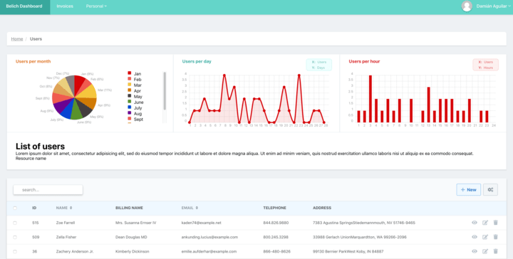

# Cards

The *cards* are a simple and quick configuration tool, which allows us to add utilities to the `index` view from our resource.

This functionality consists of two parts: a **controller** and a **view**.

The cards adapt perfectly to the structure of the metrics, so we can exchange them with each other, as you can see in the **figure 1**:

<b>fig 1</b>: Card example integrated with Graph

Or we can show it separately:

<b>fig 2</b>: A segregated Card example

Because the *card* is outside the line of the metrics, we can configure the height of the container, and any other option. In any case, the container will be sorted automatically in the best possible way.
