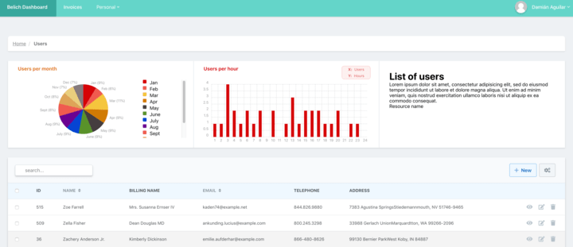
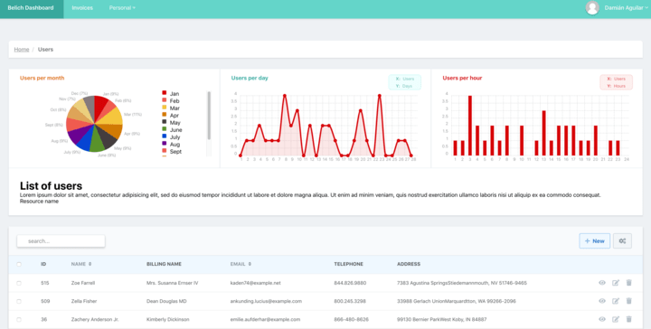

# Cards

Las tarjetas o bloques de **Belich** son una herramienta sencilla y rápida de configurar, que nos permitirá añadir utilidades a la vista: `index` de nuestro recurso. 

Esta funcionalidad, consta de dos partes: un **controlador** y una **vista**.

Las tarjetas, se adaptan perfectamente a la estructura de las gráficas, por lo que podemos intercambiarlas entre sí, tal y como se ve en la **figura 1**:

{.mx-auto .wp-75}

<b>fig 1</b>: Ejemplo de Card integrada con Gráfica

O podemos mostrarla por separado:

{.mx-auto .wp-75}

<b>fig 2</b>: Ejemplo de Card segregada

Al estar fuera de la linea de las gráficas, podemos configurar la altura del contenedor, y cualquier otra opción. En cualquier caso, el contenedor se ordenará de forma automática de la mejor manera posible.
