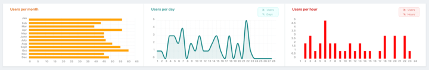
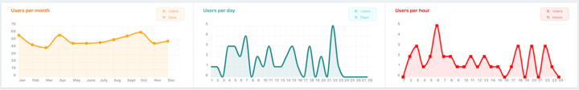

# Gráficas y estadísticas

Para la visualización de gráficas, se ha optado por la librería [ChartistJS](https://gionkunz.github.io/chartist-js/index.html){.link-out}, una opción muy ligera, completa y funcional.

**Belich** permite configurar gráficas de forma sencilla y rápida, utilizando para ello, el terminal:

```php
php artisan belich:metric MetricName
```

Generando un archivo en la ubicación: `App\Belich\Metics`. En este archivo, encontraremos dos variables para definir:

```php
//app\Belich\Metrics\MetricName.php

/** @var string */
public $type = 'bars';

/** @var string */
public $width = 'w-1/3';
```

Aunque, como veremos después, **Belich** nos ofrecerá una gama de variables para configurar bastante más amplia. Aspecto que posteriormente desarrollaremos con más detenimiento. 

## Variables 

Empecemos por las variables `$type` y `$with`, que hemos mencionado anteriormente:

###a) type

Nos permite indicar el tipo de gráfica que queremos mostrar, las opciones disponibles son:

- line
- bars
- horizontal-bars
- pie (en desarrollo)


<div id="legend"><b>fig 1</b>: Tipos de gráficas</div>

En la *figura 1*, podemos ver de izquierda a derecha, una gráfica `horizontal-bars`, otra `line` y la última: `bars`.

>Las gráficas de `pie` o gráfico circular, está disponibles solo como opción muy básica, ya que de forma nativa no está demasiado desarrollada.

###b) width

Indica el ancho de la gráfica. Para ello, se utilizan las opciones que ofrece la librería [tailwindcss](https://www.tailwindcss.com){.link-out}, y por tanto, las más utilizadas en nuestros proyectos van a ser:

- w-1/3
- w-2/3
- w-full

>Por supuesto, puedes crear tus propias clases CSS e incluirlas.

También se puede usar el método `width()` para asignar el ancho. Para más información consulte aqui: [Mas información](../resources/mandatory-methods#width).

El resto de variables que podemos utilizar, y que no están por defecto en el archivo que ha generado **Belich**, son:

### color

Nos permite definir un color genérico básico para todo nuestro gráfico, de forma que **Belich** asignará las diferentes tonalidades del color, a las diferentes partes del gráfico.

El formato para el color, debe utilizarse el nombre del mismo, a partir de la lista de colores soportados por tailwindcss. Por ejemplo: `teal`, `red`, `yellow`,...

```php
/** @var string */
public $color = 'red';
```

<div class="blockquote-alert"><strong>Recuerde</strong>: solo el nombre, no la intensidad. No utilice: <code>teal-500</code>, use: <code>teal</code>, porque estamos definiendo la plantilla de color, no un color específico.
</div>

Si lo desea, puede utilizar colores hexadecimales o rgb, pero solo aceptarán al gráfico, dejando el resto de valores: el título, la legenda, las etiquetas,... con los valores predeterminados... ¿no parece la mejor opción, no?

```php
/** @var string */
public $color = '#999999';

/** @var string */
public $color = 'rgb(238, 241, 244)';
```

### defineColors

Sirve para definir los colores concretos de cada parte del gráfico. En este caso, solo se permiten los nombres del color, o se utilizarán los valores por defecto. 

```php
/** @var array ['area-color', 'line-color', 'title-color', 'legend-color'] */
public $defineColors = [
    'title-color'  => 'green', 
    'legend-color' => 'orange',
    'line-color'   => 'blue', 
    'label-color'  => 'blue',//This is for pie graph
    'area-color'   => 'red', 
]
```

<div class="blockquote-alert"><strong>Recuerde</strong>: solo el nombre, no la intensidad. No utilice: <code>teal-500</code>, en su lugar, use: <code>teal</code>, el sistema añadirá la intensidad automáticamente en función del campo.</div>

Ambas variables: `$color` y `$defineColors` son compatibles, podemos definir un color general y luego matizar una parte del gráfico:

```php
/** @var string */
public $color = 'red';

/** @var array */
public $defineColors = [
    'title-color'  => 'green', 
]
```

Los cuatro parámetros que permite son:

- **title-color**: el color del título de la gráfica.
- **legend-color**: el color base para la leyenda.
- **line-color**: el color de la gráfica.
- **area-color**: si nuestra gráfica tiene la opción de mostrar área, podemos asignarle un color al área.

### grid

Por defecto, nuestra gráfica mostrará el `grid` para ver mejor los datos. Podemos deshabilitarlo de la siguiente forma:

```php
/** @var bool */
public $grid = false;
```

En la figura 1, se puede ver que las dos primeras gráficas tienen `grid` y la última (barras horizontales) no lo tiene.

### legend_h

Podemos asignar un nombre para la barra X (abscisas), y por tanto, crear un cuadro de leyenda.

```php
/** @var string */
public $legend_h = 'Days';
```

### legend_y

Podemos asignar un nombre para la barra Y (ordenadas), y por tanto, crear un cuadro de leyenda.

```php
/** @var string */
public $legend_y = 'Active users';
```

### marker

Podemos asignar un marcador para cada punto de la gráfica (gráficas lineales). Por defecto, el sistema lo tiene deshabilitado, pero podemos asignarle los siguientes:

- **butt**: Valor por defecto. Deshabilitar marcador.
- **square**: Muestra un cuadrado.
- **round**: Muestra un circulo.


<div id="legend"><b>fig 2</b>: Tipos de marcadores</div>

```php
/** @var string ['butt', 'square', 'round'] */
public $marker = 'square';
```

## Métodos 

**Belich** dispone de varios métodos que debemos utilizar en nuestras gráficas, es decir, son obligatorios:

### calculate

Obtiene los resultados para mostrar en la gráfica a partir de la base de datos:

```php
/**
 * Get the values from storage
 *
 * @return string
 */
public function calculate(Request $request) : array
{
    return Connection::make(User::class)
        ->lastYear()
        ->totalByMonth();
}
```

Las opciones de configuración, vienen explicadas en el apartado: [Cálculos con gráficas](calculate). 

### Labels 

Define las etiquetas para la gráfica.

```php
/**
 * Set the displayable labels
 *
 * @return string
 */
public function labels(Request $request) : array
{
    return ['Monday',...];
}
```

Pueden ser personalizadas por el usuario (recordando siempre que debe devolverse un array), o utilizar la librería de creación de etiquetas de **Belich**, la cual se explica en su propio apartado [Etiquetas para gráficas](labels). 

A continuación se puede ver un ejemplo:

```php
use Daguilarm\Belich\Components\Metrics\Labels;

/**
 * Set the displayable labels
 *
 * @return string
 */
public function labels(Request $request) : array
{
    return Labels::daysOfTheMonth();
}
```

### name

Es el nombre de la gráfica.

```php
/**
 * Set the displayable name of the metric.
 *
 * @return string
 */
public function name(Request $request)
{
    return $this->name = 'Users per month';
}
```

### uriKey

Nos permite definir nuestra gráfica con un identificador para cada una de ellas. Este parámetro se genera de forma automática al crear la gráfica con `artisan`, aunque puede ser modificado.

>Posibles errores en la visualización de gráficas: comprobar que no tengan el mismo `uriKey`.

```php
/**
 * Get the URI key for the metric.
 *
 * @return string
 */
public function uriKey()
{
    return 'users-per-month';
}
``
